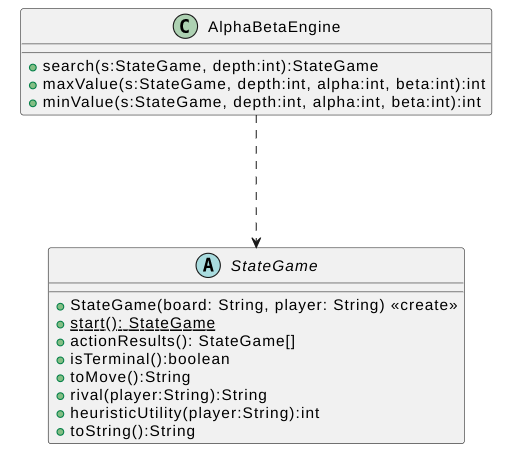

# BÚSQUEDA ADVERSARIA

**ESCUELA COLOMBIANA DE INGENIERÍA**

**PRINCIPIOS Y TECNOLOGÍAS IA 2025-2**

## Integrantes
- Andres Felipe Calderon Ramirez - [andrescalderonr](https://github.com/andrescalderonr)
- Santiago Botero Garcia - [LePeanutButter](https://github.com/LePeanutButter)


## LABORATORIO 3/4

**OBJETIVOS**

Desarrollar competencias básicas para:

1.  Modelar y resolver tareas y problemas usando busqueda adversaria
2.  Desarrollar módulos y lógica de juegos (*Game Theory*)
3.  Implementar busqueda adversaria, específicamente MiniMax

**ENTREGABLE**

*Reglas para el envío de los entregables*:

-   **Forma de envío:** Este laboratorio se debe enviar únicamente a
    través de la plataforma Moodle en la actividad definida. Se tendrán
    dos entregas: inicial y final.

-   **Formato de los archivos:** Incluyan en un archivo *.zip* los
    archivos correspondientes al laboratorio.

-   **Nomenclatura para nombrar los archivos:** El archivo deberá ser
    renombrado, "AdvSearch-lab-" seguido por los usuarios
    institucionales de los autores ordenados alfabéticamente (por
    ejemplo, se debe adicionar pedroperez al nombre del archivo, si el
    correo electrónico de Pedro Pérez es
    <pedro.perez@mail.escuelaing.edu.co>)

# **IMPLEMENTACIÓN DE BÚSQUEDA ADVERSARIA: MINIMAX PODA $\alpha$ - $\beta$**

**Para este apartado se va a implementar la lógica de juego, bajo regla
de dos jugadores, y su la decisión de la mejor acción dada por el
algoritmo de Búsqueda MiniMax optimizado con $\alpha$ - $\beta$**.

*La historia de la teoría de juegos tiene sus raíces en la estrategia
matemática y económica, siendo el teorema minimax de John von Neumann
(1928) un momento crucial que la estableció como un campo formal.
MiniMax es un algoritmo de toma de decisiones utilizado en juegos por
turnos para dos jugadores, como el tres en raya, el ajedrez y las damas.
Está diseñado para encontrar el movimiento óptimo para un jugador,
suponiendo que el oponente también juega de forma óptima.*

*Este algoritmo asume que hay dos jugadores. Un jugador actúa como MAX y
el segundo como MIN. MAX maximizará sus propias posibilidades de ganar
(puntos o recompensa, es decir, elegirá el mejor movimiento). MIN
minimizará las posibilidades de ganar del oponente (puntos o recompensa,
es decir, elegirá el peor movimiento).*



``` python
from abc import ABC, abstractmethod
from __future__ import annotations
```

## PARTE I. IMPLEMENTACIÓN DE UN JUEGO CON DOS JUGADORES

Implementar un juego para dos jugadores (ambos agentes) del tipo de
turnos o estados (teniendo en cuenta la clase *StateGame*).

### GAME THEORY: JUEGO DE ESTADOS

``` python
class StateGame(ABC):
  """ Abstracta: define los métodos clave para modelar cualquier juego por turnos (representados en estados)
  """


  @classmethod
  def start() -> StateGame:
    """ Iniciar el juego
    Args:
    Returns:
       el estado inicial del juego
    """
    pass

  def actionResults() -> list:
    """ Devuelve los próximos estados correspendientes a los movimientos legales del estado actual
    Args:
    Return:
      listado de estados del juego
    """
    pass
  def isTerminal() -> bool:
    """ Evaluar el estado actual, si es un estado que corresponde al fin del jusgo
    Args:
    Returns:
       valor de verdad a la proposición "es un estado meta?"
    """
    pass
  def toMove() -> str:
    """ Define que jugador tiene el turno en el estado actual
    Args:
    Returns:
       identificador del jugador
    """
    pass
  def rival(player: str) -> str:
    """ Define que jugador es el rival del jugador player
    Args:
      player : identificador de un jugador
    Returns:
       identificador del jugador rival
    """
    pass
  def heuristicUtility(player: str): int
    """ Establecer el criterio (heuristica) de utilidad del jugador
    Args:
      player : identificador del jugador
    Returns:
      valor de utilidad
    """
    pass
  def toString() -> str
    """ Muestra el estado del juego en formato de cadena
    Args:
    Returns:
      estado del juego
    """
    pass
```

Para el juego simple propuesto por su profesor, implemente la clase que
lo modela considerando la especificación dada.

Clase connect 4:

``` python
# Implementar la clase abstracta y documentar los métodos implementados

from __future__ import annotations
import random
from typing import List, Optional, Tuple
from src.stateGame import StateGame
from src.utils import privatemethod

class Connect4(StateGame):
    # noinspection SpellCheckingInspection
    """
    Connect 4 game implementation as a concrete subclass of StateGame.

    This class models:
      - a 6x7 Connect4 board,
      - turn-taking between players "X" and "O",
      - legal successor generation,
      - terminal state detection,
      - heuristic evaluation for minimax search,
      - optional performance optimizations such as:
            * Zobrist hashing for memoization,
            * precomputed winning lines,
            * fast local winner detection after a move.

    The implementation is fully compatible with AlphaBetaEngine.
    """

    # Board dimensions
    ROWS = 6
    COLS = 7

    # Player definitions
    PLAYERS = ["X", "O"]
    OPPONENT = {"X": "O", "O": "X"}

    # Cache: hash - winning player ("X", "O") or None
    WIN_CACHE = {}

    # List of all possible four-in-a-row coordinate groups
    LINES = []

    # noinspection SpellCheckingInspection
    # Class variable placeholder
    ZOBRIST = []

    @classmethod
    def _precompute_lines(cls) -> None:
        """
        Precompute all possible 4-cell segments on the board.

        These include:
            - horizontal lines,
            - vertical lines,
            - diagonal down-right lines,
            - diagonal down-left lines.

        This is executed once, lazily, when a Connect4 instance is created.
        """
        if cls.LINES:
            return
        lines = []
        """
        Type:
            list of list of (int, int)
        Description:
            Holds all possible 4-cell lines on the board (horizontal, vertical, diagonal).
        """

        for r in range(cls.ROWS):
            for c in range(cls.COLS - 3):
                lines.append([(r, c + i) for i in range(4)])
        for r in range(cls.ROWS - 3):
            for c in range(cls.COLS):
                lines.append([(r + i, c) for i in range(4)])
        for r in range(cls.ROWS - 3):
            for c in range(cls.COLS - 3):
                lines.append([(r + i, c + i) for i in range(4)])
        for r in range(cls.ROWS - 3):
            for c in range(3, cls.COLS):
                lines.append([(r + i, c - i) for i in range(4)])

        cls.LINES = lines

    # noinspection SpellCheckingInspection
    @classmethod
    def _init_zobrist(cls, rows: int = None, cols: int = None):
        """
        Initialize the Zobrist hashing table for Connect4.

        Zobrist hashing is a technique to efficiently compute a unique hash
        for a board position. It is particularly useful for:
            - Memoization of game states,
            - Fast lookup of previously evaluated positions,
            - Detecting repeated positions in game trees.

        This method generates a 2D array of random 64-bit integers for each
        cell in the board, for both players ("X" and "O"). Each board cell
        will have a tuple of two 64-bit numbers, one for "X" and one for "O".

        The table is stored as a class attribute `cls.ZOBRIST` to ensure
        all instances of Connect4 share the same hash table.

        The initialization is performed only once. Subsequent calls will
        not overwrite the table.

        Example structure of `cls.ZOBRIST`:
            ZOBRIST[row][col] = (hash_for_X, hash_for_O)

        Usage:
            Connect4._init_zobrist()
            zobrist_hash = some_instance._position_hash()

        Note:
            Random numbers are generated using Python's `random.getrandbits(64)`.
            For reproducible results, set a random seed before calling this method.
        """
        rows = rows or cls.ROWS
        cols = cols or cls.COLS
        cls.ZOBRIST = [[(random.getrandbits(64), random.getrandbits(64))
                        for _ in range(cols)] for _ in range(rows)]

    def __init__(self,board: Optional[List[List[Optional[str]]]] = None,player: str = "X",last_move: Optional[Tuple[int, int]] = None):
        """
        Create a new Connect4 state.

        Args:
            board: Optional board matrix (deep copied). None → new empty board.
            player: Player whose turn it is ("X" or "O").
            last_move: (row, col) of the last move, used for fast winner checks.
        """
        self._precompute_lines()
        self.board = board or [[None] * self.COLS for _ in range(self.ROWS)]
        self.player = player
        self.last_move = last_move
        if not Connect4.ZOBRIST:
            self._init_zobrist(rows=len(self.board), cols=len(self.board[0]))

    @classmethod
    def start(cls) -> "Connect4":
        """
        Return an initial empty Connect4 state.
        Player "X" always begins by convention.
        """
        return cls()

    def to_move(self) -> str:
        """
        Return the identifier of the player whose turn it is.
        """
        return self.player

    def rival(self, player: str) -> str:
        """
        Return the opponent of a given player.

        Args:
            player: The player whose rival is requested.

        Returns:
            "X" or "O".
        """
        return self.OPPONENT[player]

    def action_results(self) -> List["Connect4"]:
        """
        Generate all legal successor states by placing the player's piece
        in any non-full column.

        Returns:
            A list of new Connect4 states (0 to 7 possible).
        """
        if self.is_terminal():
            return []

        states = []
        for col in range(self.COLS):
            row = self._available_row(col)
            if row is not None:
                new_board = [r.copy() for r in self.board]
                new_board[row][col] = self.player
                states.append(Connect4(new_board, self.rival(self.player), last_move=(row, col)))
        return states

    def is_terminal(self) -> bool:
        """
        A terminal state is one where:
          - a player has achieved 4 in a row, OR
          - the board is completely full.

        Returns:
            True if the state is terminal, otherwise False.
        """
        return self._winner() is not None or self._is_full()

    def heuristic_utility(self, player: str) -> int:
        """
        Evaluate the state's value for a given player.

        Utility values:
            +10000  = the player has won.
            -10000  = the opponent has won.
            0       = otherwise (non-terminal).

        This very simple heuristic is appropriate for adversarial search
        when terminal detection is reliable.

        Args:
            player: The player for which to evaluate.

        Returns:
            An integer in {10000, -10000, 0}
        """
        winner = self._winner()
        if winner == player:
            return 10000
        elif winner == self.OPPONENT[player]:
            return -10000
        return 0

    def to_string(self) -> str:
        """
        Return a readable ASCII representation of the board.

        Example:
            | . . . . . . . |
            | . . . . . . . |
            ...
            | X O X . . . . |
              0 1 2 3 4 5 6
        """
        rows = [
            "| " + " ".join(c or "." for c in row) + " |"
            for row in self.board
        ]
        footer = "  " + " ".join(map(str, range(self.COLS)))
        return "\n".join(rows + [footer])

    @privatemethod
    def _available_row(self, col: int) -> Optional[int]:
        """
        Return the lowest available row index in a column.

        Args:
            col: Column index.

        Returns:
            The row index where a piece can fall, or None if the column is full.
        """
        for r in range(self.ROWS - 1, -1, -1):
            if self.board[r][col] is None:
                return r
        return None

    @privatemethod
    def _is_full(self) -> bool:
        """
        Check whether the board is full (i.e., no moves left).

        Returns:
            True if the board is full, False otherwise.
        """
        return all(self.board[0][c] is not None for c in range(self.COLS))

    @privatemethod
    def _position_hash(self) -> int:
        # noinspection SpellCheckingInspection
        """
        Compute a Zobrist hash for the current board position.
        This allows fast winner memoization.

        Returns:
            A 64-bit integer hash representing the board.
        """
        if Connect4.ZOBRIST is None:
            self._init_zobrist(rows=len(self.board), cols=len(self.board[0]))

        h = 0
        for r in range(self.ROWS):
            for c in range(self.COLS):
                v = self.board[r][c]
                if v is None: continue
                idx = 0 if v == "X" else 1
                h ^= self.ZOBRIST[r][c][idx]
        return h

    @privatemethod
    def _winner(self) -> Optional[str]:
        # noinspection SpellCheckingInspection
        """
        Determine if the current state has a winning player.

        The result is memoized using a Zobrist hash for performance.
        """
        h = self._position_hash()
        cached = self.WIN_CACHE.get(h)
        if cached is not None:
            return cached
        w = self._winner_fast()
        self.WIN_CACHE[h] = w
        return w

    @privatemethod
    def _winner_fast(self) -> Optional[str]:
        """
        Determine the current winner using a fast-first strategy.

        Strategy
        - If `last_move` is set and points to a non-empty cell, perform a constant-time
          directional scan through that cell (four directions) to detect any 4-in-a-row
          that includes the last move. This is the **fast path** and runs in O(1)
          relative to the board size (bounded by a small constant).
        - If `last_move` is None or points to an empty cell, fall back to scanning
          all precomputed 4-cell lines stored in `self.LINES`. This is the **slow path**
          but still small in practice because `LINES` contains only valid 4-length
          winning combinations.

        Preconditions
        - `self.board` is a ROWS x COLS 2D list.
        - `self.LINES` is an iterable of 4-tuples/lists of (row, col) coordinates.
        - Tokens stored in `board` are comparable values (e.g., "X", "O", or None).

        Returns
        - The token that has won ("X" or "O") if a 4-in-a-row is found, otherwise None.

        Complexity
        - Best case (fast path hit): O(1) work (constant number of cell checks).
        - Fallback: O(L) where L is the number of precomputed 4-cell lines in `self.LINES`.
        """
        # Try fast path first, then fall back to slow path
        winner = self._check_last_move()
        if winner is not None:
            return winner
        return self._check_all_lines()

    def _count_dir(self, r0: int, c0: int, dr: int, dc: int, p: str) -> int:
        """
        Count consecutive tokens equal to p in a single direction.

        The count starts at the cell adjacent to (r0, c0) in direction (dr, dc)
        and continues while cells remain in bounds and equal to p.

        Parameters
        - r0, c0: starting coordinates (the origin cell is NOT counted).
        - dr, dc: direction step (row delta, column delta). Typical values are -1, 0, 1.
        - p: token to match (e.g., "X" or "O").

        Returns
        - Number of consecutive cells equal to p in the given direction.

        Notes
        - This helper does not validate that (r0, c0) itself contains p; it only
          walks outward from that cell.
        - Use this together with a symmetric call in the opposite direction to
          compute the total run length that includes the origin cell.
        """
        cnt = 0
        r, c = r0 + dr, c0 + dc
        while 0 <= r < self.ROWS and 0 <= c < self.COLS and self.board[r][c] == p:
            cnt += 1
            r += dr
            c += dc
        return cnt

    def _check_last_move(self) -> Optional[str]:
        """
        Fast path winner check that inspects only lines passing through last_move.

        Behavior
        - If `self.last_move` is None, returns None immediately.
        - If the cell at `last_move` is empty (None), returns None.
        - Otherwise, for each of the four canonical directions (horizontal,
          vertical, two diagonals), count matching tokens on both sides of the
          last-move cell and return the token if the total run length is >= 4.

        Returns
        - The winning token if a 4-in-a-row includes the last move, otherwise None.

        Implementation details
        - Directions checked: (0,1) horizontal, (1,0) vertical, (1,1) diag down-right,
          (1,-1) diag down-left.
        - For each direction (dr, dc) we compute:
            total = 1 + _count_dir(r0, c0, dr, dc, p) + _count_dir(r0, c0, -dr, -dc, p)
          and compare total >= 4.
        """
        if self.last_move is None:
            return None

        r0, c0 = self.last_move
        p = self.board[r0][c0]
        if p is None:
            return None

        dirs = ((0, 1), (1, 0), (1, 1), (1, -1))
        for dr, dc in dirs:
            if 1 + self._count_dir(r0, c0, dr, dc, p) + self._count_dir(r0, c0, -dr, -dc, p) >= 4:
                return p
        return None

    def _check_all_lines(self) -> Optional[str]:
        """
        Slow path winner check that scans all precomputed 4-cell winning lines.

        Behavior
        - Iterates over `self.LINES`, where each entry is a sequence of four
          (row, col) coordinates representing a potential winning line.
        - For each line, if the first cell is non-empty and all remaining cells
          in the line equal that first cell, returns that token immediately.

        Returns
        - The winning token if any 4-cell line is fully occupied by the same token,
          otherwise None.

        Notes
        - This function assumes `self.LINES` contains only valid coordinates within
          the board bounds. If `LINES` may contain out-of-bounds coordinates,
          validate them before use.
        - Using `all(...)` keeps the check concise and short-circuits on mismatch.
        """
        for line in self.LINES:
            r0, c0 = line[0]
            a = self.board[r0][c0]
            if a is None:
                continue
            # all remaining cells must equal a
            if all(self.board[r][c] == a for r, c in line[1:]):
                return a
        return None
```
Clase stategame:

``` python
from __future__ import annotations
from abc import ABC, abstractmethod
from typing import List

class StateGame(ABC):
    """
    Abstract base class for modeling turn-based, state-driven games.

    This class defines the interface that any game state must implement
    in order to be compatible with generic search algorithms such as
    minimax, alpha-beta pruning, Monte Carlo search, etc.

    A `StateGame` instance represents a *single state* of the game
    and must provide:
      - How to obtain the initial state
      - What actions are possible from this state
      - Whether the state is terminal
      - Which player is to move
      - How to identify the opponent
      - A heuristic evaluation function
      - A human-readable representation of the state
    """

    @classmethod
    @abstractmethod
    def start(cls) -> "StateGame":
        """
        Return the initial state of the game.

        This is typically used to bootstrap search algorithms or
        game simulations.

        Returns:
            StateGame: The initial game state.
        """
        raise NotImplementedError

    @abstractmethod
    def action_results(self) -> List["StateGame"]:
        """
        Return the list of all states reachable by applying
        any legal action from the current state.

        Each resulting state should represent the game after one action
        by the player whose turn it is.

        Returns:
            List[StateGame]: A list of successor states.
        """
        raise NotImplementedError

    @abstractmethod
    def is_terminal(self) -> bool:
        """
        Determine whether the current state is a terminal state.

        A terminal state is one where:
          - the game has ended, and
          - no further moves are allowed.

        Returns:
            bool: True if the state is terminal, False otherwise.
        """
        raise NotImplementedError

    @abstractmethod
    def to_move(self) -> str:
        """
        Return the identifier of the player whose turn it is
        in the current state.

        Returns:
            str: The player who must act next.
        """
        raise NotImplementedError

    @abstractmethod
    def rival(self, player: str) -> str:
        """
        Return the opponent of the given player.

        Args:
            player (str): The player whose opponent is requested.

        Returns:
            str: The rival player.
        """
        raise NotImplementedError

    @abstractmethod
    def heuristic_utility(self, player: str) -> int:
        """
        Evaluate the current state using a heuristic utility function.

        Positive values should favor the given player,
        while negative values should favor the opponent.

        Args:
            player (str): The player for whom the utility is evaluated.

        Returns:
            int: The heuristic score of this state.
        """
        raise NotImplementedError

    @abstractmethod
    def to_string(self) -> str:
        """
        Return a readable, printable string representation
        of the current game state.

        Returns:
            str: A human-friendly description of the state.
        """
        raise NotImplementedError


```

## PARTE II. IMPLEMENTACIÓN DE BÚSQUEDA: MINIMAX $\alpha$ - $\beta$

Implementar la lógica de búsqueda adversaria para que el jugador tome
una decisión y generé una acción (la mejor posible)

### BÚSQUEDA ADVERSARIA: MINIMAX PODA $\alpha$ - $\beta$

``` python
class AlphaBetaEngine():
  """ Algoritmo de búsqueda adversaria MiniMax con poda (optimización) por AlphaBeta
  """
  def search(s: StateGame, depth: int) -> StateGame:
    """ Generar mejor acción/transición del juego a partir de un estado
    Args:
       s : estado de juego
       depth : profundidad de búsqueda deseada
    Returns:
       siguiente estado decidido
    """
    pass

  def maxValue(s: StateGame, depth: int, alpha: int, beta: int) -> int:
    """ Evaluar valor para MAX
    Args:
       s : estado de juego
       depth : profundidad de búsqueda deseada
       alpha : valor de criterio alfa
       alpha : valor de criterio beta
    Return:
      valor calculado para MAX
    """
    pass
  def minValue(s: StateGame, depth: int, alpha: int, beta: int) -> int:
    """ Evaluar valor para MIN
    Args:
       s : estado de juego
       depth : profundidad de búsqueda deseada
       alpha : valor de criterio alfa
       alpha : valor de criterio beta
    Returns:
       valor calculado para MIN
    """
    pass
```

``` python
# A partir de dos posibles estados iniciales, pruebe el desarrollo del juego y las decisiones por heurisrica MiniMax

from __future__ import annotations
from src.stateGame.StateGame import StateGame

class AlphaBetaEngine:
    """
    Minimax adversarial search algorithm with Alpha-Beta pruning.

    This class is designed to be used as a mixin: its methods expect
    `self` to be a `StateGame` instance. The game state provides:
      - available successor states,
      - terminal state detection,
      - turn information,
      - heuristic utility evaluation.
    """

    def search(self, s: StateGame, depth: int) -> StateGame:
        """
        Compute the best next state from the current one using Minimax
        with Alpha-Beta pruning.

        Args:
            s (StateGame): Current game state.
            depth (int): Maximum search depth.

        Returns:
            StateGame: The selected successor state.
        """

        best_state = None
        best_value = float("-inf")
        inf = 10 ** 9
        alpha, beta = -inf, inf

        for child in s.action_results():
            value = self.min_value(child, depth - 1, alpha, beta)
            if value > best_value:
                best_value = value
                best_state = child

            alpha = max(alpha, best_value)

        return best_state

    def max_value(self, s: StateGame, depth: int, alpha: int, beta: int) -> int:
        """
        Compute the value of a MAX node (player to maximize utility).

        Args:
            s (StateGame): Current game state.
            depth (int): Remaining search depth.
            alpha (int): Alpha pruning parameter.
            beta (int): Beta pruning parameter.

        Returns:
            int: The best utility value MAX can secure.
        """
        if depth == 0 or s.is_terminal():
            return s.heuristic_utility(s.to_move())

        value = float("-inf")

        for child in s.action_results():
            value = max(value, self.min_value(child, depth - 1, alpha, beta))
            alpha = max(alpha, value)

        if value >= beta:
            return value

        return value

    def min_value(self, s: StateGame, depth: int, alpha: int, beta: int) -> int:
        """
        Compute the value of a MIN node (opponent of current player).

        Args:
          s (StateGame): Current game state.
          depth (int): Remaining search depth.
          alpha (int): Alpha pruning bound.
          beta (int): Beta pruning bound.

        Returns:
          int: The best utility value MIN can secure (minimizing).
        """
        if depth == 0 or s.is_terminal():
            opponent = s.rival(s.to_move())
            return s.heuristic_utility(opponent)

        value = float("inf")

        for child in s.action_results():
            value = min(value, self.max_value(child, depth - 1, alpha, beta))
            beta = min(beta, value)

        if value <= alpha:
            return value

        return value

```

## RETROSPECTIVA

**1.** ¿Cuál fue el tiempo total invertido en el laboratorio por cada
uno de ustedes? (Horas/Hombre)

4 horas- Santiago Botero

3 horas - Andres Calderon

**2.** ¿Cuál es el estado actual del laboratorio? ¿Por qué?

Está completado, se logró una buena coordinación y comunicación entre los miembros del equipo para el desarrollo del laboratorio.

**3.** ¿Cuál consideran fue el mayor logro? ¿Por qué?

Lograr optimizar el modelo y que el modelo funcione teniendo en cuenta el juego de Connect 4

**4.** ¿Cuál consideran que fue el mayor problema técnico? ¿Qué hicieron
para resolverlo?

Optimizarlo por qué era muy lento entonces para tratar de optimizar el modelo antes de llegar a lo de AlphaBetaEngine se hizo una optimización con códigos hash Zobrits para memoizacion

**5.** ¿Qué hicieron bien como equipo? ¿Qué se comprometen a hacer para
mejorar los resultados?

Logramos ponernos deacuerdo en como desarrollar el laboratorio y tenerlo hecho en poco tiempo, nos comprometemos a seguir mejorando con nuestro trabajo.

**6**.¿Qué referencias usaron? ¿Cuál fue la más útil? Incluya citas con
los estándares adecuados.

E, S. (2024, 13 septiembre). The History of Connect 4: From Its Inception to Becoming a Classic. Elakai Outdoor. https://elakaioutdoor.com/blogs/lifestyle/the-history-of-connect-4-from-its-inception-to-becoming-a-classic

*Incluyan las respuesta*
